# ToDoList - nodejs

Aplicacion para seguimiento de tareas, realizado con Node.js / Express. 

Incluye la creacion de tableros para direrenciar temas, recordatorios, cargar en las tareas archivos, recordatorio e historial. 

Instalacion
---------------------------------

Luego de descargar el repositorio y ejecutar:
```
npm install
npm postinstall
```
_El ultimo comando genera la estructura de carpetas para que funcione_


Funciones
---------------------------------
En la parte superior se encuentra la barra general:

> 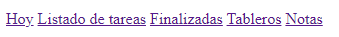

### -Tableros

Los tableros guardar un listado de tareas de un mismo tema. Desde aqui se pueden ver los tableros generados y generar nuevos

> 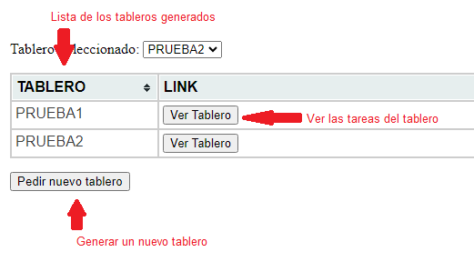

### -Listado de tareas

Seleccionando el tablero correspondiente, se pueden observar las tareas que lo conforman, su estado, avance, si es importante y/o prioritario, ademas de generar nuevas tareas. Con el selector superior se puede elegir que tablero se quiere mostrar

> 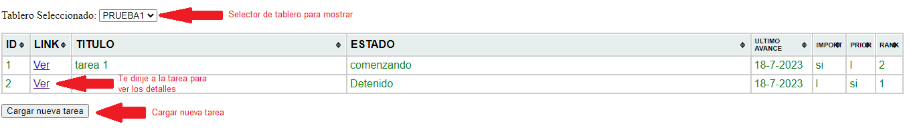
> 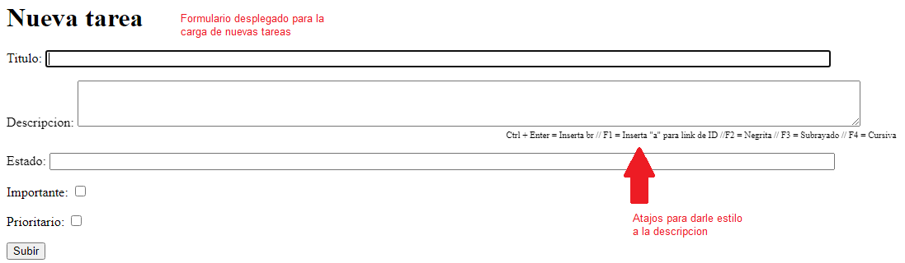

_La tareas cambian de color al pasar el tiempo del ultimo avance. Pasado las 2 semanas se muestran en rojo_

### -Finalizadas

Cuando se marca una tarea como finalizada, se deja de mostrar en el listado de tareas y pasa a mostrarse en esta pestaña. Es similar al listado de tareas

> 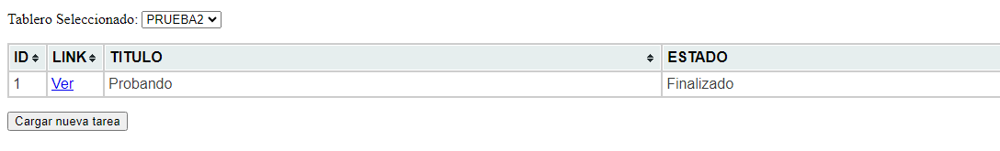

### -Detalle de tareas

Muestra el detalle de la tarea, descripcion, avances, archivos adjuntos. El estado se puede cambiar manualmente pero si se ingresa un avance se actualizara con el avance.

Permite cargar recordatorios se veran en la pestaña "Hoy" e indica para que fecha se cargo el ultimo recordatorio. En los archivos adjuntos se puede cargar cualquier cosa, si es un mail se mostrara un PDF con el cuerpo de mail, ademas de permitir descargarlo

> 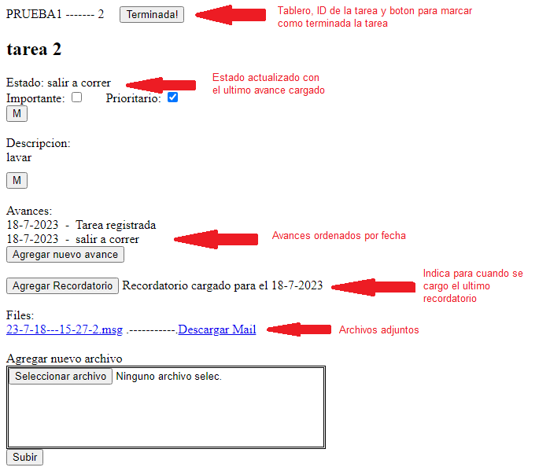

### -Hoy

Muestra los recordatorios, sean de tareas o independiente, para el dia de hoy y de fechas anteriores.

> 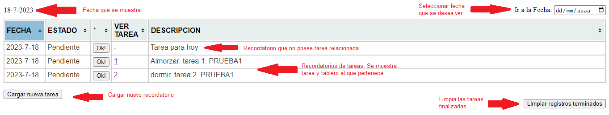

El recordatorio cambia de color al pasar el tiempo, de negro a naranja y por ultimo rojo, si no se marca como finalizada (la cual se marcara en verde):

En el dia:
> 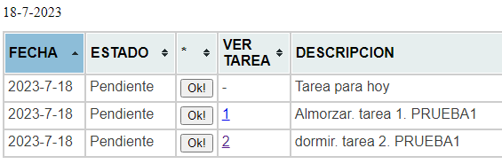

Pasado 1 semana:
> 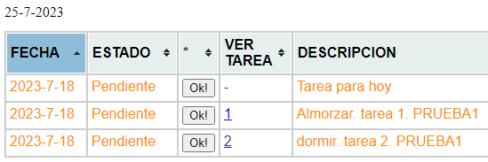

Pasado 3 semanas (tambien se marcar una como finalizada):
> 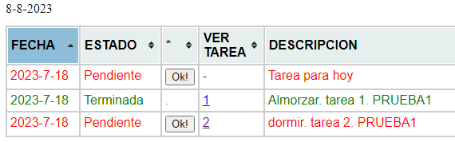


### -Notas

Para cargar algun recordatorio sin importancia pero que se quiere tener a mano

> 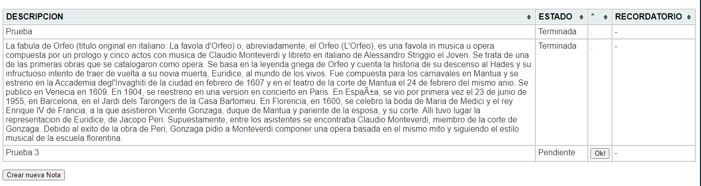


